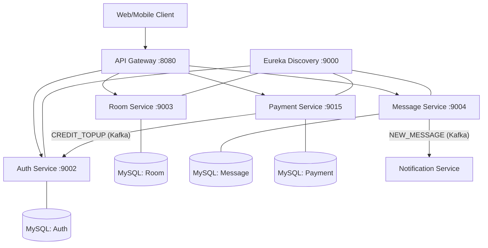
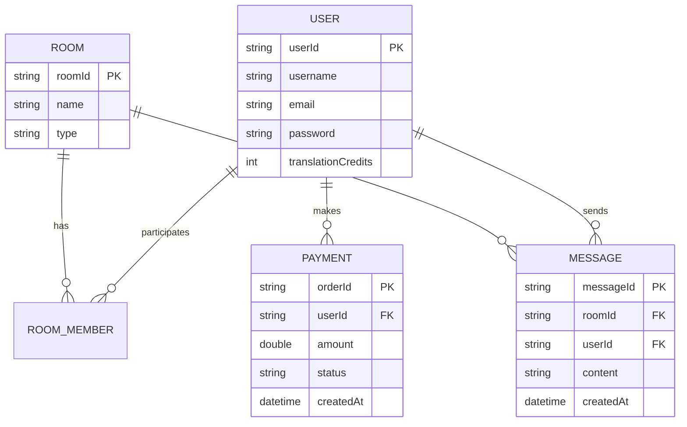
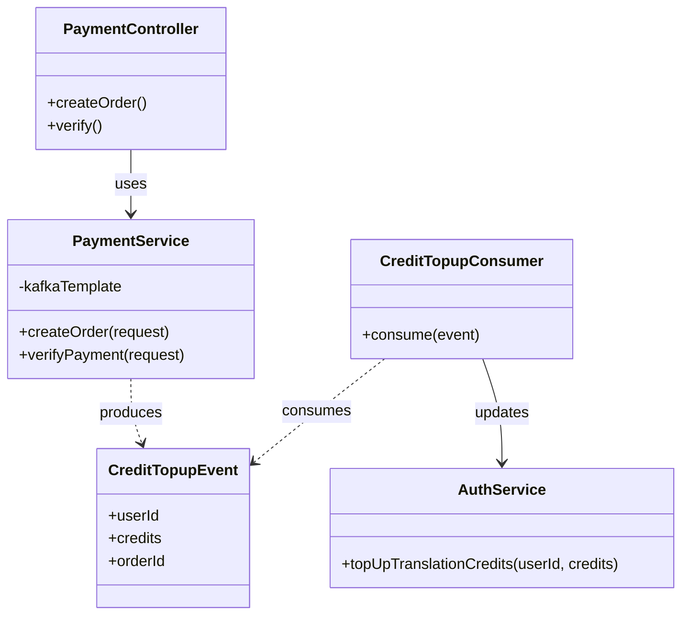

# ConnectHub Architecture & Documentation

This document outlines the system architecture, entity relationships, and core class structure for the ConnectHub project.

## 1. System Architecture

ConnectHub is built as a microservices-based system using Spring Cloud. Key components include an API Gateway for request routing and security, a Discovery Server for service registration, and several domain-specific microservices.

## 2. Entity Relationship Diagram (ERD)

The core data model revolves around Users, Rooms, Messages, and Payments.

## 3. Core Class Diagram (Payment & Auth)

The following diagram illustrates the key classes involved in the Payment and Auth interaction via Kafka.

