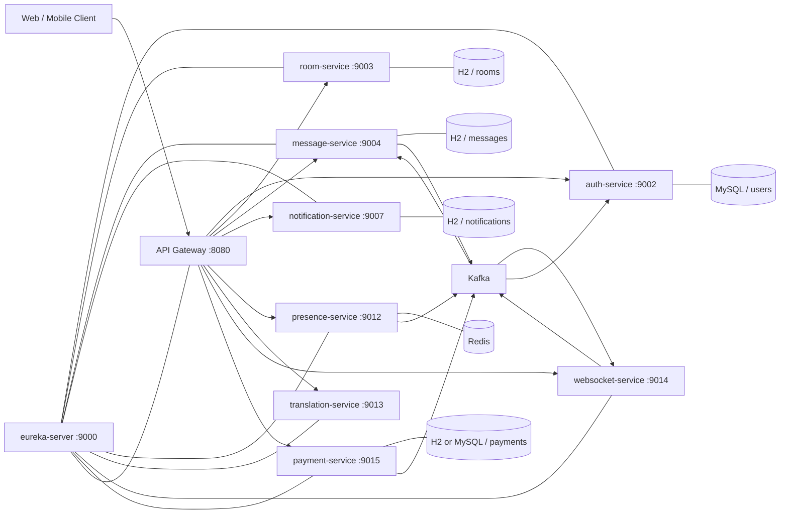
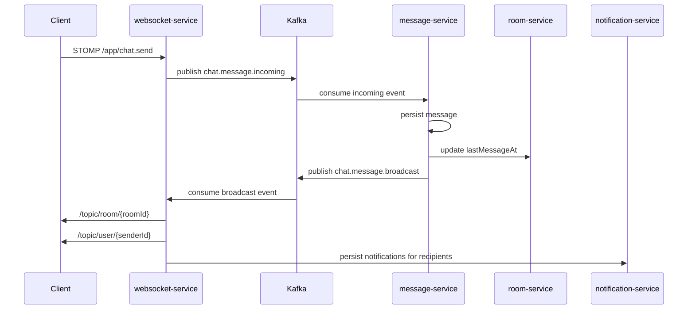
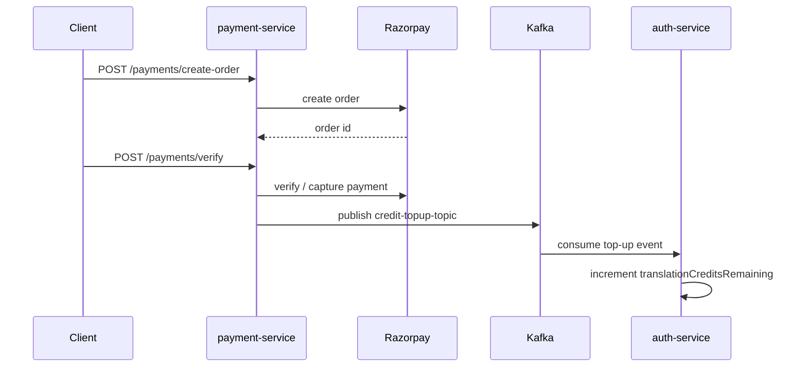

# ConnectHub Backend Production Documentation

## 1. Purpose and Scope

This document is the primary technical reference for the ConnectHub backend. It describes the current implementation of the project as it exists in the repository and is intended to support:

- architecture reviews
- onboarding for developers and reviewers
- demo preparation
- deployment planning
- production hardening discussions
- operational troubleshooting

The scope of this document covers the backend services under `backend/`, their runtime dependencies, their public and internal interfaces, and the main end-to-end business flows.

## 2. System Summary

ConnectHub is a microservices-based backend for a real-time multilingual communication platform. The platform combines:

- account registration and authentication
- contact management
- room and membership management
- real-time chat over WebSocket/STOMP
- durable message persistence
- message search and attachments
- notification persistence
- translation with credit consumption
- payment-driven credit top-up
- service discovery and gateway-based routing

At a high level, the system uses synchronous HTTP for CRUD-style operations and asynchronous Kafka messaging for decoupled event processing in the chat and payment flows.

## 3. Technology Stack

### Application stack

- Java 17
- Spring Boot 3.3.5
- Spring Cloud 2023.0.3
- Spring Cloud Gateway
- Eureka service discovery
- Spring Data JPA
- Spring Web / WebFlux
- Spring WebSocket + STOMP + SockJS
- Spring Kafka
- Spring Data Redis
- OpenFeign
- SpringDoc OpenAPI / Swagger UI

### Data and infrastructure

- MySQL for `auth-service`
- H2 file-backed databases for `room-service`, `message-service`, `notification-service`, and local `payment-service`
- MySQL container for `payment-service` in Docker Compose
- Redis for presence state
- Kafka + Zookeeper for event streaming
- local filesystem storage for message attachments and uploaded assets

### External integrations

- LibreTranslate API for translation
- Razorpay API for payment order creation and verification
- SMTP for OTP and receipt email delivery

## 4. Module Inventory

The Maven aggregator at the repository root includes the following backend modules:

- `eureka-server`
- `gateway-service`
- `auth-service`
- `room-service`
- `message-service`
- `notification-service`
- `presence-service`
- `translation-service`
- `websocket-service`
- `payment-service`

## 5. Runtime Topology

### Exposed service ports

| Component | Port | Purpose |
| --- | --- | --- |
| `eureka-server` | `9000` | service registry |
| `gateway-service` | `8080` | single entry point for HTTP and WebSocket traffic |
| `auth-service` | `9002` | identity, contacts, profile, credits |
| `room-service` | `9003` | room and membership management |
| `message-service` | `9004` | message persistence, history, search, attachments, translation orchestration |
| `notification-service` | `9007` | durable unread notifications |
| `presence-service` | `9012` | Redis-backed presence API |
| `translation-service` | `9013` | translation provider wrapper |
| `websocket-service` | `9014` | STOMP/WebSocket messaging |
| `payment-service` | `9015` | order creation, payment verification, credit sync |
| `mysql` | `3306` | relational persistence |
| `redis` | `6379` | ephemeral presence state |
| `kafka` | `9092` | host Kafka listener |

### High-level architecture



## 6. Gateway and Discovery

### Eureka

`eureka-server` runs on port `9000` and is configured as a standalone registry:

- `register-with-eureka: false`
- `fetch-registry: false`

Every runtime service other than Eureka registers with it and resolves other services using logical service names.

### Gateway routing

`gateway-service` is the single public HTTP entry point. It routes traffic by path prefix:

- `/auth/**` -> `AUTH-SERVICE`
- `/rooms/**` -> `ROOM-SERVICE`
- `/messages/**` -> `MESSAGE-SERVICE`
- `/notifications/**` -> `NOTIFICATION-SERVICE`
- `/presence/**` -> `PRESENCE-SERVICE`
- `/translate/**` and `/api/translate/**` -> `TRANSLATION-SERVICE`
- `/payments/**` -> `PAYMENT-SERVICE`
- `/ws/**` -> `WEBSOCKET-SERVICE`

Special route:

- `/payments/users/**` is rewritten and proxied to `/auth/users/**` on `AUTH-SERVICE`

### Gateway security behavior

The gateway contains a global `JwtFilter` that enforces `Authorization: Bearer <token>` for non-public routes. The following route groups are treated as public by the filter:

- `/auth/**`
- `/ws/**`
- `/translate/**`
- `/api/translate/**`
- Swagger/OpenAPI endpoints

This means the gateway is the primary request guard for most non-public routes.

## 7. Service Catalog

### 7.1 `auth-service`

**Primary responsibilities**

- user registration
- OTP-gated signup
- login and JWT issuance
- forgot-password and reset-password flow
- user lookup and search
- profile updates and avatar upload
- password change
- online status persistence on profile
- contact management
- translation credit consumption and top-up
- Kafka consumer for payment credit sync

**Data store**

- MySQL (`connecthub_auth`)

**Important REST surface**

- `POST /auth/register`
- `POST /auth/register/initiate`
- `POST /auth/register/complete`
- `POST /auth/login`
- `POST /auth/forgot-password`
- `POST /auth/verify-otp`
- `POST /auth/reset-password`
- `GET /auth/users/{userId}`
- `GET /auth/users/by-email`
- `GET /auth/users/search`
- `PUT /auth/users/{userId}/profile`
- `POST /auth/users/{userId}/avatar`
- `GET /auth/users/{userId}/avatar`
- `PUT /auth/users/{userId}/password`
- `PUT /auth/users/{userId}/status`
- `POST /auth/users/{userId}/translation-credits/consume`
- `POST /auth/users/{userId}/translation-credits/top-up`
- `GET /auth/users/{userId}/contacts`
- `GET /auth/users/{userId}/contacts/search`
- `POST /auth/users/{userId}/contacts`
- `DELETE /auth/users/{userId}/contacts/{contactId}`

**Key domain data**

- unique `userId`
- email and optional phone number
- password hash
- username, full name, avatar, bio
- preferred language
- translation credit balance
- role
- online status / last seen

**Integration points**

- consumes Kafka topic `credit-topup-topic`
- exposes credit consumption and credit top-up APIs used by `message-service` and `payment-service`

### 7.2 `room-service`

**Primary responsibilities**

- create group rooms
- create direct rooms
- fetch rooms by user
- fetch room details and members
- add and remove members
- promote and demote admins
- leave room
- update room metadata
- delete room
- update `lastMessageAt`

**Data store**

- H2 file database (`./data/room-service`)

**Important REST surface**

- `POST /rooms/create`
- `POST /rooms`
- `POST /rooms/direct`
- `GET /rooms/users/{userId}`
- `GET /rooms/{roomId}`
- `GET /rooms/{roomId}/members`
- `POST /rooms/add`
- `POST /rooms/{roomId}/members`
- `POST /rooms/remove`
- `DELETE /rooms/{roomId}/members/{userId}`
- `POST /rooms/promote`
- `PUT /rooms/{roomId}/admins/{userId}`
- `DELETE /rooms/{roomId}/admins/{userId}`
- `POST /rooms/{roomId}/leave/{userId}`
- `PUT /rooms/{roomId}`
- `DELETE /rooms/{roomId}`
- `PUT /rooms/{roomId}/last-message`

**Key domain data**

- room metadata: name, type, description, avatar, privacy, max members
- room ownership: `createdBy`
- room recency: `lastMessageAt`
- membership entries with member role, joined time, last read time, mute flag

### 7.3 `message-service`

**Primary responsibilities**

- save messages
- persist file attachment messages
- fetch latest messages
- paginate message history
- search within room history
- download attachment payloads and metadata
- edit and delete messages
- add reactions
- orchestrate translation for a specific message
- consume translation credits and trigger refunds on translation failure
- update room recency metadata
- Kafka persistence listener for async chat ingestion

**Data store**

- H2 file database (`./data/message-service`)
- local upload directory `uploads`

**Important REST surface**

- `POST /messages`
- `GET /messages/{roomId}`
- `GET /messages/{roomId}/history`
- `GET /messages/{roomId}/search`
- `POST /messages/attachments`
- `GET /messages/{roomId}/attachments/{messageId}`
- `GET /messages/{roomId}/attachments/{messageId}/metadata`
- `PUT /messages/{roomId}/{messageId}`
- `DELETE /messages/{roomId}/{messageId}`
- `POST /messages/{roomId}/{messageId}/reactions`
- `GET /messages/{roomId}/{messageId}/translate`

**Key domain data**

- sender
- room ID
- message content
- message type
- attachment metadata
- reply-to message ID
- deleted and edited timestamps
- detected language

**Integration points**

- Feign client to `auth-service` for translation credit changes
- Feign client to `room-service` for `lastMessageAt`
- Feign client to `translation-service` for translation execution
- Kafka consumer: `chat.message.incoming`
- Kafka producer: `chat.message.broadcast`

### 7.4 `notification-service`

**Primary responsibilities**

- persist notifications
- fetch unread notifications
- unread count
- mark single notification as read
- mark all notifications as read

**Data store**

- H2 file database (`./data/notification-service`)

**Important REST surface**

- `POST /notifications`
- `GET /notifications/{userId}`
- `GET /notifications/{userId}/count`
- `PUT /notifications/{id}/read`
- `PUT /notifications/{userId}/read-all`

### 7.5 `presence-service`

**Primary responsibilities**

- mark user online
- mark user offline
- fetch current user presence
- publish presence changes to Kafka

**Data store**

- Redis key/value entries with key prefix `user:status:`

**Important REST surface**

- `POST /presence/online/{userId}`
- `POST /presence/offline/{userId}`
- `GET /presence/{userId}`

**Integration points**

- Kafka producer: `user.presence`

### 7.6 `translation-service`

**Primary responsibilities**

- translate text payloads
- normalize and validate language inputs
- call Gemini first for translation plus typo correction
- fail over to LibreTranslate when Gemini is unavailable
- detect source language
- return fallback translation when provider is unavailable

**Data store**

- none

**Important REST surface**

- `POST /translate`
- `POST /api/translate`

**Integration points**

- outbound HTTP to Gemini (`translation.gemini.*`) with LibreTranslate fallback (`translation.api.*`)

### 7.7 `websocket-service`

**Primary responsibilities**

- STOMP endpoint registration
- real-time chat event intake
- typing indicators
- read receipts
- reaction broadcasts
- Kafka-backed message fan-out
- room topic delivery
- user topic delivery
- room-member notification fan-out
- profile online/offline updates on WebSocket connect/disconnect

**Protocol surface**

- WebSocket/SockJS endpoint: `/ws`
- client send prefix: `/app`
- room subscription prefix: `/topic/room/{roomId}`
- user subscription prefix: `/topic/user/{userId}`

**Inbound message mappings**

- `/app/chat.send`
- `/app/chat.typing`
- `/app/chat.read`

**Integration points**

- Kafka producer: `chat.message.incoming`
- Kafka consumer: `chat.message.broadcast`
- Feign clients to `auth-service`, `room-service`, `notification-service`

### 7.8 `payment-service`

**Primary responsibilities**

- expose top-up configuration and plans
- create payment orders with Razorpay
- verify payment signatures
- capture provider payments if needed
- persist payment audit trail
- publish successful credit top-up events to Kafka
- send payment receipt email
- serve top-up page entry path

**Data store**

- H2 file database by default
- MySQL in Docker Compose

**Important REST surface**

- `GET /payments/config`
- `GET /payments/history/{userId}`
- `POST /payments/create-order`
- `POST /payments/verify`
- `GET /payments/topup` and `/payments` forwarded to static top-up page

**Payment plans**

Built-in plans in the current code:

- `spark` -> `50` credits -> `99.00 INR`
- `boost` -> `150` credits -> `249.00 INR`
- `power` -> `400` credits -> `599.00 INR`
- `elite` -> `1000` credits -> `1199.00 INR`

Custom plans are also supported using a configurable per-credit rate.

**Integration points**

- outbound HTTP to Razorpay API
- Kafka producer: `credit-topup-topic`
- optional user enrichment from `auth-service`
- SMTP receipt email generation

## 8. Core Domain Model

### User

Owned by `auth-service`.

Key fields:

- `userId`
- `email`
- `phoneNumber`
- `username`
- `fullName`
- `avatarUrl`
- `bio`
- `preferredLanguage`
- `translationCreditsRemaining`
- `role`
- `onlineStatus`
- `lastSeenAt`

### Room

Owned by `room-service`.

Key fields:

- `roomId`
- `name`
- `roomType` (`GROUP` or `DIRECT`)
- `createdBy`
- `isPrivate`
- `maxMembers`
- `description`
- `avatarUrl`
- `inviteCode`
- `createdAt`
- `lastMessageAt`

### RoomMember

Owned by `room-service`.

Key fields:

- `id`
- `roomId`
- `userId`
- `role` (`ADMIN` or `MEMBER`)
- `joinedAt`
- `lastReadAt`
- `muted`

### Message

Owned by `message-service`.

Key fields:

- `id`
- `sender`
- `content`
- `roomId`
- `timestamp`
- `messageType`
- attachment metadata
- `replyToMessageId`
- `deleted`
- `editedAt`
- `deletedAt`
- `detectedLanguage`

### Notification

Owned by `notification-service`.

Key fields:

- `id`
- `userId`
- `message`
- `read`
- `timestamp`

### Payment

Owned by `payment-service`.

Key fields:

- `id`
- `orderId`
- `paymentId`
- `signature`
- `amount`
- `amountInPaise`
- `currency`
- `planCode`
- `planName`
- `status`
- `userId`
- `customerName`
- `customerEmail`
- `credits`
- `receipt`
- `receiptEmailedAt`
- `lastError`
- `createdAt`
- `updatedAt`
- `verifiedAt`
- `creditedAt`

## 9. Messaging and Event Model

### Kafka topics currently used

| Topic | Producer | Consumer | Purpose |
| --- | --- | --- | --- |
| `chat.message.incoming` | `websocket-service` | `message-service` | decouple incoming live messages from persistence |
| `chat.message.broadcast` | `message-service` | `websocket-service` | broadcast persisted messages back to subscribers |
| `credit-topup-topic` | `payment-service` | `auth-service` | sync purchased translation credits |
| `user.presence` | `presence-service` | none in current backend | publish presence changes for future consumers |

### Asynchronous chat flow



### Payment credit-sync flow



## 10. End-to-End Functional Flows

### 10.1 Registration and login

1. Client calls `POST /auth/register/initiate` to begin OTP registration.
2. `auth-service` validates the request and emails a verification code.
3. Client calls `POST /auth/register/complete`.
4. User record is created in MySQL.
5. Client calls `POST /auth/login`.
6. `auth-service` returns JWT plus user profile summary.

### 10.2 Contact management

1. Client searches users or existing contacts.
2. Client saves contacts under `/auth/users/{userId}/contacts`.
3. Contact records are stored by `auth-service`.

### 10.3 Room creation and membership

1. Client creates a direct or group room through `room-service`.
2. `room-service` persists the room and member entries.
3. Admin actions such as add/remove/promote/demote are managed by the same service.

### 10.4 Real-time chat

1. Client connects to `/ws`.
2. Client subscribes to `/topic/room/{roomId}` and `/topic/user/{userId}`.
3. Client sends chat events to `/app/chat.send`.
4. `websocket-service` sanitizes payloads and publishes to Kafka.
5. `message-service` persists the message and republishes a saved message event.
6. `websocket-service` broadcasts the saved event to room subscribers.
7. Notifications are also pushed to user-specific topics and persisted for offline retrieval.

### 10.5 Typing, reactions, and read receipts

- typing events go to `/app/chat.typing`
- read receipts go to `/app/chat.read`
- reactions are created through `message-service` and broadcast by `websocket-service`

These are modeled as real-time events rather than full CRUD resources.

### 10.6 Message translation

1. Client requests `GET /messages/{roomId}/{messageId}/translate?userId=...`.
2. `message-service` loads the message text.
3. `message-service` asks `auth-service` to consume one translation credit.
4. `message-service` calls `translation-service`.
5. `translation-service` tries Gemini first, falls back to LibreTranslate if needed, and finally uses the offline dictionary fallback.
6. If translation fails after credit consumption, `message-service` attempts a refund by calling the top-up endpoint for one credit.
7. Response returns translated text, source language, target language, and remaining credits.

### 10.7 Payment and top-up

1. Client fetches available plans from `GET /payments/config`.
2. Client creates an order with `POST /payments/create-order`.
3. `payment-service` creates a Razorpay order and stores a `CREATED` payment row.
4. Client completes provider checkout and calls `POST /payments/verify`.
5. `payment-service` verifies signature, captures payment if required, and marks the payment paid.
6. `payment-service` publishes `credit-topup-topic`.
7. `auth-service` consumes the event and updates the user credit balance.
8. `payment-service` emails a receipt if email delivery succeeds.

## 11. WebSocket Contract

### Endpoint

- handshake endpoint: `/ws`
- SockJS fallback enabled

### Headers

The current `websocket-service` presence listener expects a native STOMP header:

- `userId`

It uses this value to mark the user `ONLINE` on connect and `OFFLINE` on disconnect through `auth-service`.

### Subscription destinations

- room stream: `/topic/room/{roomId}`
- user stream: `/topic/user/{userId}`

### Supported event types observed in `websocket-service`

- standard text message
- file message
- `TYPING_INDICATOR`
- `REACTION`
- `READ_RECEIPT`
- `MESSAGE_TRANSLATED`
- notification fan-out events

## 12. Configuration and Environment

This section lists the configuration surface that matters for deployment. In production, all secrets and provider credentials should be injected through environment variables or a secret manager, not committed defaults.

### Common service discovery setting

Most services use:

- `EUREKA_CLIENT_SERVICEURL_DEFAULTZONE`

### `auth-service`

Important configuration keys:

- `SPRING_DATASOURCE_URL`
- `SPRING_DATASOURCE_USERNAME`
- `SPRING_DATASOURCE_PASSWORD`
- `SPRING_DATASOURCE_DRIVER_CLASS_NAME`
- `jwt.secret`
- `CONNECTHUB_TOPUP_SECRET`
- SMTP credentials under `spring.mail.*`

### `room-service`

Important configuration keys:

- `SPRING_DATASOURCE_URL`
- `SPRING_DATASOURCE_USERNAME`
- `SPRING_DATASOURCE_PASSWORD`
- `SPRING_DATASOURCE_DRIVER_CLASS_NAME`

### `message-service`

Important configuration keys:

- `SPRING_DATASOURCE_URL`
- `SPRING_DATASOURCE_USERNAME`
- `SPRING_DATASOURCE_PASSWORD`
- `SPRING_DATASOURCE_DRIVER_CLASS_NAME`
- `SPRING_KAFKA_BOOTSTRAP_SERVERS`
- `app.upload-dir`

### `notification-service`

Important configuration keys:

- `SPRING_DATASOURCE_URL`
- `SPRING_DATASOURCE_USERNAME`
- `SPRING_DATASOURCE_PASSWORD`

### `presence-service`

Important configuration keys:

- `REDIS_HOST`
- `REDIS_PORT`
- `REDIS_DB`
- `REDIS_PASSWORD`
- `REDIS_TIMEOUT`
- `SPRING_KAFKA_BOOTSTRAP_SERVERS`

### `translation-service`

Important configuration keys:

- `translation.api.url`
- `translation.api.timeout`
- `TRANSLATION_API_KEY`
- `translation.gemini.url`
- `translation.gemini.model`
- `GEMINI_API_KEY`

### `websocket-service`

Important configuration keys:

- `SPRING_KAFKA_BOOTSTRAP_SERVERS`
- `app.websocket.endpoint`
- `app.websocket.application-destination-prefix`
- `app.websocket.broker-prefixes`
- `app.websocket.allowed-origin-patterns`
- `app.websocket.heartbeat-incoming`
- `app.websocket.heartbeat-outgoing`
- `app.websocket.room-topic-prefix`
- `app.websocket.user-topic-prefix`

### `payment-service`

Important configuration keys:

- `SPRING_DATASOURCE_URL`
- `SPRING_DATASOURCE_USERNAME`
- `SPRING_DATASOURCE_PASSWORD`
- `AUTH_SERVICE_BASE_URL`
- `CONNECTHUB_TOPUP_SECRET`
- `RAZORPAY_KEY_ID`
- `RAZORPAY_KEY_SECRET`
- `PAYMENT_TOPUP_RETURN_URL`
- SMTP credentials under `spring.mail.*`
- `app.topup.custom-credit-rate`
- `app.topup.min-credits`
- `app.topup.max-credits`

## 13. Deployment Modes

### Docker Compose mode

The repository provides `docker-compose.yml` for end-to-end backend startup. It provisions:

- Zookeeper
- Kafka
- Redis
- MySQL
- all backend services

Start:

```powershell
docker compose up --build -d
```

Stop:

```powershell
docker compose down
```

Reset state:

```powershell
docker compose down -v
```

### Local Maven mode

Two helper scripts exist:

- `start_services.ps1`
- `launch_detached.ps1`

`start_services.ps1` attempts to:

- stop conflicting processes on known ports
- optionally start Kafka, Redis, and MySQL via Docker if available
- boot each Spring Boot service with Maven
- fall back to H2 for `payment-service` when MySQL is unavailable

## 14. API Discovery and Documentation

Each Spring Boot service is configured with SpringDoc and exposes:

- OpenAPI docs: `/v3/api-docs`
- Swagger UI: `/swagger-ui.html`

The gateway also exposes SpringDoc UI.

## 15. Observability and Operations

### Health and metrics

`websocket-service` exposes actuator health/info/metrics endpoints.

For operational parity in production, the same pattern should be extended to the remaining services.

### Logs

Current logging behavior is console/file oriented through service startup scripts. No centralized logging stack is included in the repository.

### Recommended production observability additions

- Prometheus scraping for all services
- Grafana dashboards
- centralized structured logging
- correlation IDs across gateway and downstream services
- dead-letter handling for Kafka consumers

## 16. Testing Status

Automated tests are present in multiple services, including:

- `auth-service`
- `gateway-service`
- `message-service`
- `payment-service`
- `room-service`
- `translation-service`
- `websocket-service`

Representative test areas include:

- auth validation and service behavior
- gateway JWT utility/filter behavior
- message controller behavior
- payment service behavior
- room direct-room behavior
- translation service behavior
- chat service behavior

## 17. Security Posture

The current implementation contains security-relevant mechanisms, but it should be treated as a project ready for hardening rather than a fully hardened production deployment.

### Security features already present

- JWT issuance in `auth-service`
- JWT validation at gateway level for non-public routes
- BCrypt password encoding
- internal top-up secret check in `auth-service`
- payment signature verification in `payment-service`

### Important hardening gaps

1. `auth-service` currently permits all HTTP requests in `SecurityConfig`.
2. The gateway currently treats the full `/auth/**` route space as public, so non-login auth endpoints still require endpoint-level authorization hardening.
3. Several application config files contain committed credentials or placeholder secrets and must be externalized immediately.
4. Attachment storage is local filesystem-based and is not safe for multi-instance scaling without shared storage.
5. The gateway allows `/ws/**` as a public route; if authenticated WebSocket sessions are required, a stronger handshake/auth strategy should be added.
6. No rate limiting is implemented at the gateway.
7. No role-based authorization layer is enforced across service APIs.
8. No secrets manager, key rotation, or encrypted config strategy is included.
9. No DLQ or retry policy documentation is included for Kafka consumers.

## 18. Current Implementation Notes and Mismatches

These points are intentionally documented because they affect production readiness and operational correctness.

### 18.1 Payment provider is Razorpay, not PayPal

The current `payment-service` implementation creates and verifies Razorpay orders and signatures. Some configuration text still references PayPal, and legacy PayPal properties exist in configuration, but the active code path is Razorpay-based.

### 18.2 Presence exists in two places

The platform has:

- a dedicated `presence-service` backed by Redis and Kafka
- a WebSocket session listener that directly updates `auth-service` online status

These mechanisms are complementary today, but they are not yet unified behind one canonical presence source.

### 18.3 Payment database differs by runtime mode

- local application config defaults to H2
- Docker Compose overrides `payment-service` to use MySQL

This is valid for development, but migration strategy and schema governance should be standardized for production.

### 18.4 Auth service database expectation

`auth-service` expects a MySQL datasource by default and does not have the same H2 local fallback used by several other services.

### 18.5 Presence events are published but not consumed by the current backend

`presence-service` publishes `user.presence` to Kafka, but no current backend consumer is registered for that topic.

### 18.6 Translation refund is best-effort

`message-service` attempts to refund one translation credit when translation fails after credit consumption. This path is wrapped in a fail-safe catch block and should be validated carefully in production because the auth top-up endpoint itself is protected by an internal secret header.

## 19. Production Readiness Checklist

Before declaring the platform production-ready, the following should be completed:

### Security

- externalize all secrets and credentials
- lock down `auth-service` route authorization
- implement gateway rate limiting
- add service-to-service auth where needed
- secure WebSocket handshake/authentication

### Reliability

- move attachments and avatars to object storage
- add Kafka retry / DLQ strategy
- add database migration tooling such as Flyway or Liquibase
- define backup and restore plans

### Observability

- enable health endpoints on all services
- add metrics scraping and dashboards
- centralize logs
- add request tracing

### Platform operations

- containerize with production-grade image hardening
- provide Kubernetes or equivalent deployment manifests
- define readiness/liveness probes for every service
- document scaling guidance per service

## 20. Recommended Production Evolution

If the project is extended beyond demo and portfolio use, the next engineering steps should be:

1. centralize auth and authorization rules across gateway and services
2. standardize all databases on a managed relational store with migrations
3. replace local file storage with object storage
4. promote presence to a single authoritative service and integrate it with WebSocket delivery
5. add consumer retry, DLQ, and idempotency guarantees for Kafka workflows
6. add CI/CD, infrastructure as code, and environment-specific config management

## 21. Reference Files

The following source files are the most important references for this document:

- `ARCHITECTURE.md`
- `docker-compose.yml`
- `gateway-service/src/main/resources/application.yaml`
- `auth-service/src/main/java/com/connecthub/authservice/controller/AuthController.java`
- `auth-service/src/main/java/com/connecthub/authservice/controller/ContactController.java`
- `auth-service/src/main/java/com/connecthub/authservice/consumer/CreditTopupConsumer.java`
- `room-service/src/main/java/com/connecthub/roomservice/controller/RoomController.java`
- `message-service/src/main/java/com/connecthub/messageservice/controller/MessageController.java`
- `message-service/src/main/java/com/connecthub/messageservice/listener/MessageKafkaListener.java`
- `notification-service/src/main/java/com/connecthub/notificationservice/controller/NotificationController.java`
- `presence-service/src/main/java/com/connecthub/presenceservice/controller/PresenceController.java`
- `translation-service/src/main/java/com/connecthub/translationservice/controller/TranslationController.java`
- `websocket-service/src/main/java/com/connecthub/websocketservice/controller/ChatController.java`
- `websocket-service/src/main/java/com/connecthub/websocketservice/service/ChatService.java`
- `websocket-service/src/main/java/com/connecthub/websocketservice/listener/WebSocketPresenceListener.java`
- `payment-service/src/main/java/com/connecthub/paymentservice/controller/PaymentController.java`
- `payment-service/src/main/java/com/connecthub/paymentservice/service/PaymentService.java`
- `payment-service/src/main/java/com/connecthub/paymentservice/service/PaymentPlanCatalog.java`

## 22. Document Ownership

This document should be updated whenever one of the following changes:

- service boundaries
- Kafka topics or event flows
- gateway routes
- public REST endpoints
- WebSocket contract
- provider integrations
- runtime configuration or deployment strategy
